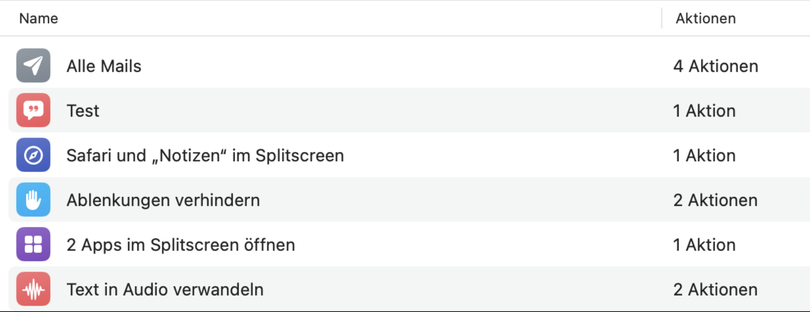
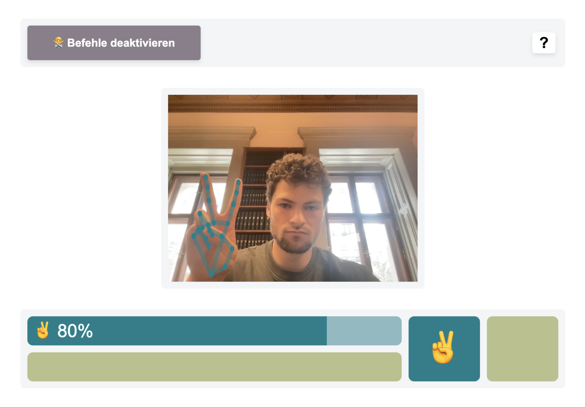
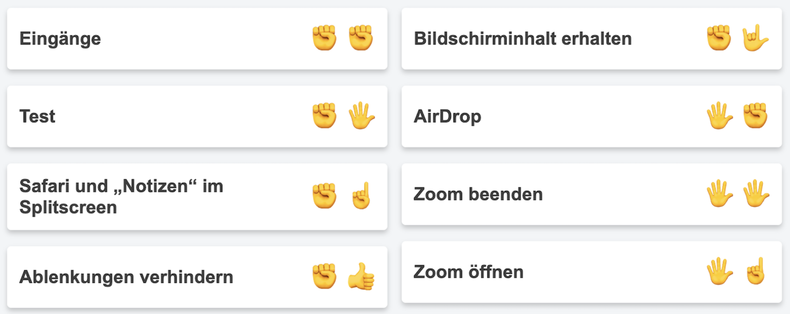

# WebForce
Dieses Programm ermöglicht es, auf einem Mac Befehle mit Gesten auszuführen.
Hierfür werden die Kurzbefehle von macOS verwendet. Dafür müssen welche in der
App definiert sein.

Drücke auf "Anwendung Starten" und erlaube der Anwendung auf die Kamera zuzugreifen. Nun werden die Apple-Kurzbefehle in einer Liste abgelegt. Jedem Kurzbefehl wird ein Gestenpaar zugewiesen. Du kannst mit deinen Händen die 7 Gesten (✊ 🖐 ☝ 👍 👎 ✌ 🤟) nachmachen. Füre zuerst die linke und dann die rechte Geste des Kurbefehls mit deiner linken und rechten Hand aus, um den jeweiligen Befehl zu aktivieren.

Es gibt Feedback-Töne und Anzeigen anhand derer man erkennen kann, ob die Geste erkannt wurde oder ob die Reihenfolge oder das Timing nicht gestimmt haben.  

Um ein eigenes Gestenpaar zuzuweisen, klicke auf den Befehl und führe die gewünschte Geste aus. Dafür müssen Befehle aktiviert sein. Ansonsten wird der Befehl direkt ausgeführt.

Setup: npm install (wenn electron nicht installiert wird: npm install electron)

Ausführen: npm start

Exportieren: npm run build
(webforce.dmg wird in /dist erstellt)

CSS funktioniert nur mit Internetverbindung

Fehlerfälle:
Kein CSS:
    -> Internetverbindung prüfen
"Anwendung starten"-Button funktioniert nicht (vlt Problem mit Berechtigungen)
    -> Repository in package.json: "name" anders benennen